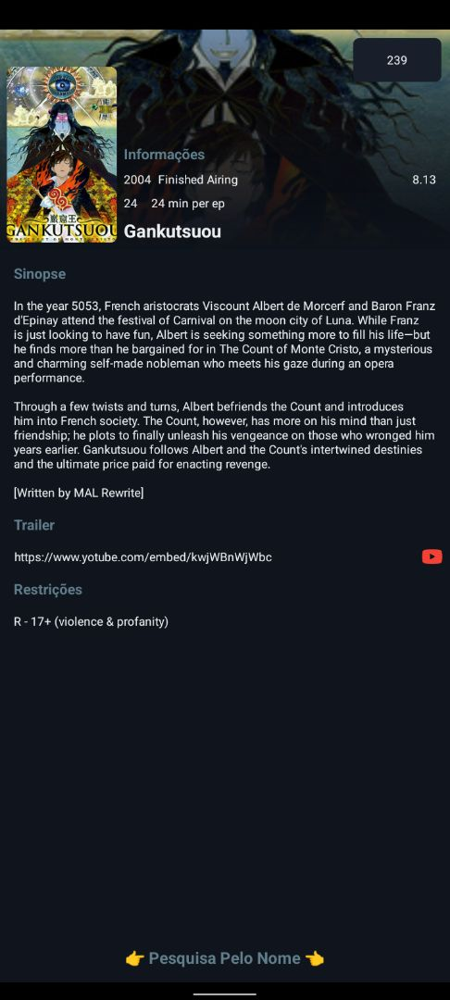

# My AnimeList API 2.0

## Descrição

My AnimeList API 2.0 é um projeto modificado para melhorar a experiência de pesquisa de animes. Com foco na usabilidade, o projeto foi quase totalmente traduzido para o português, com a adição de uma área de pesquisa pelo nome e integração com uma API de tradução.

## Funcionalidades

- **Projeto 100% Modificado**
- **Área de Pesquisa Pelo Nome Adicionado**
- **API de Tradução na Área de Pesquisa Pelo Nome**
- **Projeto 99% em Português**
  - **Observação**: Na área "Pesquisa Pelo Nome", a sinopse é limitada em português. Quando o limite diário for atingido, a sinopse será exibida em inglês.

## Prints da Aplicação

### Tela Principal

### Tela de Pesquisa

### Tela de Resultados

### Tela de Sinopse

## Créditos

- Desenvolvido por: [Bearer_of_Shadow](https://t.me/Bearer_of_Shadow)

## Licença

Este projeto está licenciado sob a Licença MIT. Veja o arquivo [LICENSE.md](LICENSE.md) para mais detalhes.
